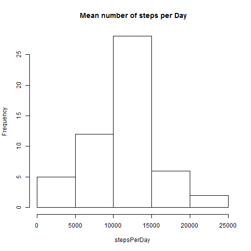

# Reproducible Research: Peer Assessment 1

## Loading and preprocessing the data

```r
    # Read the dataset
    df <- read.csv("C:/Users/Liz/Desktop/DataScienceSpecialisation/5_Reproducible Research/activity.csv", header = TRUE)
```

## What is mean total number of steps taken per day?

```r
    # remove missing values 
    dfNoMissingValues <- df[!is.na(df$steps),]

    # Make a histogram of the total number on steps taken each day    
    stepsPerDay<-tapply(dfNoMissingValues$steps, dfNoMissingValues$date, FUN=sum)
    stepsPerDay <- stepsPerDay[!is.na(stepsPerDay)]
    hist(stepsPerDay, main = " Mean number of steps per Day")
```

 

```r
    # Caluculate and report the mean and median total number of steps taken per day
```
The mean total number of steps taken per day is 1.0766 &times; 10<sup>4</sup>  
The median total number of steps taken per day is 10765


```r
    ## What is the average daily activity pattern?
    meanStepsPerInterval<-tapply(dfNoMissingValues$steps, dfNoMissingValues$interval, FUN=mean)
    plot(meanStepsPerInterval, type="l", main="Plot showing average steps across time intervals", xlab="time interval", ylab ="Number of Steps", xaxt = 'n')
    axis(1, c(0,50,100,150,200,250),labels=c(0,500,1000,1500,2000,2500))
```

 

```r
    # Which 5-minute interval, on average across all the days in the dataset, contains the maximum number of steps?
    max <- meanStepsPerInterval[meanStepsPerInterval == max(meanStepsPerInterval)]
```
The 5-minute interval, on average that contains the maximum number of steps is interval 835  


## Inputing missing values
There are missing values in the step variable, showing value NA.   
The number of rows with missing values is 2304  

These missing values in the steps variable have been replaced using the overall average number of steps.  
This simple strategy replace each NA with overal mean which is 37.3826  

create a new dataset (dfnew)  with the missing values filled in

```r
dfnew <- df
dfnew$steps[is.na(df$steps)] <- mean(dfNoMissingValues$steps)

AdjustedStepsPerDay<-tapply(dfnew$steps, dfnew$date, FUN=sum)
hist(AdjustedStepsPerDay, main = " Mean number of steps per Day")
```

 

```r
adjustedMean <- mean(AdjustedStepsPerDay)   
adjustedMedian <- median(AdjustedStepsPerDay) 
```
With the missing value filled in the mean number of total steps per day is 1.0766 &times; 10<sup>4</sup> and the median is 1.0766 &times; 10<sup>4</sup>  

Do these differ from the original values where the missing values were removed?  
The difference in mean is 0 and the difference in the median is -1.1887  
So the mean has not changed but the median is slightly bigger with the missing values filled in.  
This means that the simple strategy used for replacing missing values  has slightly skewed the data.


## Are there differences in activity patterns between weekdays and weekends?

```r
    dfnew$weekday <- weekdays(as.Date(dfnew$date))
    
    dfnew$dayType[dfnew$weekday == "Saturday" | dfnew$weekday == "Sunday"] <- "weekend"
    dfnew$dayType[dfnew$weekday == "Monday" | dfnew$weekday == "Tuesday" |dfnew$weekday == "Wednesday" | dfnew$weekday == "Thursday" | dfnew$weekday =="Friday"] <- "weekday"
    
    dfnew$dayType <- as.factor(dfnew$dayType)
    dfWeekdays <- dfnew[dfnew$dayType == "weekday",]
    dfWeekend <- dfnew[dfnew$dayType == "weekend",]
    par(mfrow = c(2,1))
        weekendMeanStepsPerInterval<-tapply(dfWeekend$steps, dfWeekend$interval, FUN=mean)
        plot(weekendMeanStepsPerInterval, type="l", main="Weekend", xlab="time interval", ylab ="Number of Steps", xaxt = 'n', col = "blue", ylim=c(0,250))
        axis(1, c(0,50,100,150,200,250),labels=c(0,500,1000,1500,2000,2500))
    
        weekdayMeanStepsPerInterval<-tapply(dfWeekdays$steps, dfWeekdays$interval, FUN=mean)
        plot(weekdayMeanStepsPerInterval, type="l", main="Weekdays", xlab="time interval", ylab ="Number of Steps", xaxt = 'n', col = "blue", ylim=c(0,250))
        axis(1, c(0,50,100,150,200,250),labels=c(0,500,1000,1500,2000,2500))
```

 
library(knitr)
library(markdown)
knit("PA1_template.Rmd")
